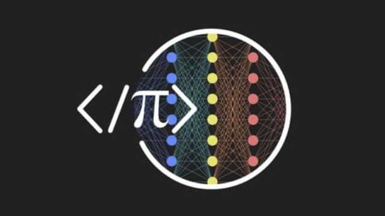

# COURSE: A deep understanding of deep learning

<p align="center">
    
</p>

TEACHER: Mike X Cohen, sincxpress.com

COURSE URL: udemy.com/course/deeplearning_x/?couponCode=202212

Kaggle Dataset Link: [WineQuality](https://www.kaggle.com/datasets/yasserh/wine-quality-dataset),[MNIST](https://www.kaggle.com/datasets/oddrationale/mnist-in-csv)

Disclaimer: I have ZERO affilation with Professor Mike nor Udemy. Just an ambitious learner ♪—— Ｏ（≧∇≦）Ｏ ——♪

## Inspiration

Machine Learning is one of my career interests. In the past, I have been working on projects that involves algorithms like Linear Regressions, Decision Trees, and KNN Classifiers. Recently, I have participated in a [hackathon project](https://devpost.com/software/farmer-vision) with my friend and got fascinated by the power of CNN in detecting plant diseases. Eventually, we won as a Best Use of AI/ML. This prompts me to learn more about deep learning.

From my perspective, Mike is a pretty cool instructor. I enjoy his straightforward explanation of the topics. I appreciate how he links the concepts to real-world coding applications. This is a great course if you are new or still building a solid foundation to deep learning!

Udemy often offers a large discount on the courses (It was 75% off when I bought it). So if my notebook sparks your interest on deep learning, feel free to check out the course!

## Guide to Use this Notebook

It is recommended to use this notebook on Google Collab. There is some limitation when I ran on Jupyter Notebook (Lack free GPU and downloadable datasets).

- For Google Collabs: Don't change runtime environment to GPUs unless you see lines like `device = torch.device("cuda" if torch.cuda.is_available() else "cpu")`. Overusing them may lead to Google Colab restricting GPU access.

The number before each folder/file indicates its **sequence in the section**. I recommend you to explore those folder/file **in order** because many are built on top of each other.

These folders are divided into **2 categories**:

1. On-paper Theory Notes: `00-paper-notes`
2. Coding Notes: From `01-python` to `24-RNN`

Feel free to tweak the parameters to facilltate your learning experiences, especially for the milestone project folders like `14-FFNmilestone`

## Configure

I didn't include some dataset files because they take too much storage (some are ~1GB)
Here is the step-by-step direction to set **each** of them up manually:

---

**cifar10 Dataset**

1. Open your notebook at `12-data/07-DUDL_data_data2colab.ipynb`
2. Run the following 2 code cells:

```python
# Download this on the shell if you haven't
!pip install torchvision
```

```python
# FOR Image Processing
import torchvision
cdata = torchvision.datasets.CIFAR10(root='cifar10', download=True)
print(cdata)
```

3. Remove `download=True` from the second code cell after dataset is downloaded

---

**emnist dataset**

1. Use Google Collab (as this may not work on Jupyter Notebook!)
2. Open your notebook at `19-CNN/11-DUDL_CNN_EMNIST.ipynb`
3. Run the following code cell:

```python
cdata = torchvision.datasets.EMNIST(root='emnist',split='letters', download=True)
```

4. Remove `download=True` from the code cell after dataset is downloaded

---

**fmnist dataset**

1. Open your notebook at `20-CNNmilestone/DUDL_CNNmilestone_project3.ipynb`
2. Run the following code cell:

```python
trainset = torchvision.datasets.FashionMNIST(root='../fmnist', train=True, transform=transform, download=True)
devtest  = torchvision.datasets.FashionMNIST(root='../fmnist', train=False, transform=transform)
```

3. Remove `download=True` from the code cell after dataset is downloaded

---

**stl10**

1. Open your notebook at `21-transferlearning/03-DUDL_transfer_resnet.ipynb`
2. Run the following code cell:

```python
trainset = torchvision.datasets.STL10(root='./stl10', split='train', transform=transform, download=True)
testset  = torchvision.datasets.STL10(root='./stl10', split='test',  transform=transform)
```

3. Remove `download=True` from the code cell after dataset is downloaded
